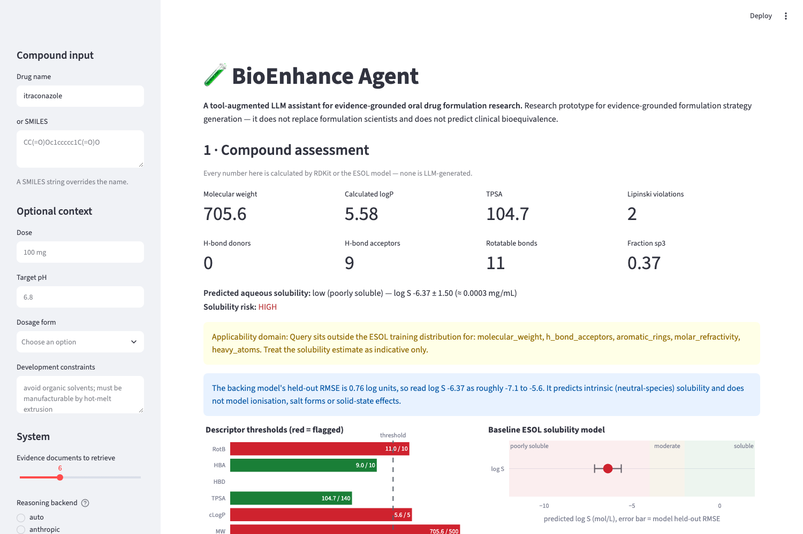

# BioEnhance Agent

**A tool-augmented LLM assistant for evidence-grounded oral drug formulation research.**

A research prototype for evidence-grounded formulation strategy generation. Given a drug
name or SMILES string, it calculates molecular descriptors, estimates aqueous solubility
with a model trained on measured data, retrieves real formulation literature, and asks an
LLM to rank bioenhancement strategies using *only* that supplied material, then checks
that every citation it produced actually resolves to a retrieved document.

It does not replace formulation scientists and does not predict clinical bioequivalence.

---

## Research problem

Roughly 40% of marketed oral drugs and a larger share of development candidates are poorly
water soluble. When a compound cannot dissolve in gastrointestinal fluid, oral exposure is
limited regardless of how good the target biology is. Formulation scientists respond with
bioenhancement strategies (amorphous solid dispersions, lipid-based systems, cocrystals,
salts, cyclodextrins, nanosuspensions), and choosing among them early, before much
experimental data exists, is a recurring decision problem.

That early decision is made from sparse information: a structure, maybe a dose, and
whatever the literature says about similar molecules. It is a plausible place for a
language model to help, and a dangerous one, because the cost of a confident wrong answer
is a wasted formulation campaign.

## Why LLM-only systems are insufficient

Ask a general-purpose LLM to recommend a formulation strategy and three failure modes
appear immediately:

1. **It invents molecular properties.** Asked for the logP of a compound, it produces a
   plausible number from memory. That number is not calculated, and it is often wrong.
2. **It invents citations.** Asked to support a recommendation, it generates
   realistic-looking references (correct-sounding journal, plausible year, author names
   that exist) for papers that do not.
3. **It does not distinguish calculation from speculation.** A descriptor, a
   literature-supported conclusion, and a guess arrive in the same confident register.

This project's response is to remove those jobs from the model. The LLM never computes a
property and never supplies a reference. It receives calculated descriptors from RDKit, a
solubility estimate from a model trained on measured data, and abstracts retrieved from a
curated library, and its only task is to reason over that material and rank strategies.

The claim that the system is grounded is then **tested rather than asserted**: every run is
passed through a check that verifies each cited source id corresponds to a document that
was genuinely retrieved. A fabricated citation fails the check and is surfaced to the user
in red.

## System architecture

```
  drug name ──> PubChem ──┐
                          ├──> SMILES ──> RDKit descriptors ──┐
  SMILES ─────────────────┘                    │              │
                                               v              │
                                    ESOL random forest        │
                                    (log S + error bar)       │
                                               │              │
                                               v              v
                                    descriptor-derived    calculated
                                    retrieval query        facts
                                               │              │
                                               v              │
                              evidence library (50 real       │
                              PubMed OA abstracts)            │
                                               │              │
                                     embeddings + FAISS       │
                                     (TF-IDF fallback)        │
                                               │              │
                                               v              v
                                       ┌──────────────────────────┐
                                       │   LLM (structured JSON)  │
                                       └──────────────────────────┘
                                               │
                                               v
                                    Pydantic validation
                                               │
                                               v
                                    grounding check ──> AgentResult
                                    (did it cite only
                                     what it was given?)
```

| Component | Technology |
|---|---|
| Interface | Streamlit |
| Molecular calculations | RDKit |
| Baseline ML | scikit-learn (random forest) |
| Solubility data | Delaney ESOL (1128 measured compounds) |
| Embeddings | sentence-transformers (`all-MiniLM-L6-v2`) |
| Retrieval | FAISS, with an exact TF-IDF fallback |
| LLM | Local (Ollama) by default, or a hosted API. Only Anthropic's API is wired up so far. |
| Structured responses | Pydantic v2 |
| Testing | pytest (68 tests; 66 run with no network) |
| Visualisation | Plotly |

## Molecular-property calculations

`src/descriptors.py` calculates molecular weight, Wildman-Crippen cLogP, TPSA, hydrogen-bond
donors and acceptors, rotatable bonds, aromatic rings, fraction sp3, molar refractivity, and
Lipinski/Veber rule indicators.

Drug names are resolved to structures through **PubChem**, not through the model's memory.
An LLM recalling a SMILES string is exactly the failure this project exists to avoid.

One deliberate detail: RDKit reports caffeine's TPSA as 61.82 Ų where PubChem publishes
58.44 Ų. Neither is wrong. RDKit perceives caffeine's two amide ring nitrogens as aromatic
(Ertl contribution 4.93 Ų each); the published value treats them as non-aromatic tertiary
nitrogens (3.24 Ų each), and 2 × (4.93 − 3.24) = 3.38 Ų is exactly the gap. The test suite
pins RDKit's value and documents why, so anyone cross-checking against PubChem knows which
convention these numbers are computed in.

## Solubility model

A random forest trained on the **Delaney ESOL** dataset (1128 compounds with measured log S).
Features are recomputed from SMILES with the same RDKit code path used at inference, so
training and prediction cannot silently diverge.

Held-out test performance (20% split, n=226):

| Metric | Value |
|---|---|
| RMSE | **0.758** log units |
| MAE | 0.516 log units |
| R² | 0.878 |
| 5-fold CV RMSE | 0.668 ± 0.052 |

Most important feature: cLogP (0.474), then molar refractivity (0.202) and molecular weight
(0.099), all chemically sensible for aqueous solubility.

The model reports three things beyond a point estimate, because a bare number would invite
more trust than it deserves:

- **An ensemble spread** (standard deviation across the forest's trees).
- **Its own held-out RMSE**, surfaced in the UI and in the prompt, so the LLM and the user
  both know the estimate is worth roughly ±0.76 log units.
- **An applicability-domain warning** when a query falls outside the 1st–99th percentile
  box of the training features. Itraconazole (MW 706) triggers this correctly: ESOL is
  dominated by smaller molecules, and the prototype says so rather than quietly
  extrapolating.

## Evidence-retrieval pipeline

The evidence library is **50 real open-access PubMed records** covering all ten strategy
families: amorphous solid dispersions, lipid-based systems, salt formation, cocrystals,
cyclodextrins, nanosuspensions, particle-size reduction, supersaturating formulations,
precipitation inhibition, and poorly soluble oral drugs generally.

**No document in this library was written by an LLM.** Every record is harvested from
PubMed's E-utilities API by `scripts/harvest_evidence.py`, and each carries a real PMID, a
real journal and year, and the genuine abstract text. Records without an abstract, a year or
a journal are rejected at harvest, because a document that cannot be cited honestly does not
belong in a library whose purpose is honest citation. Rebuild or refresh it any time:

```bash
python scripts/harvest_evidence.py
```

The test suite checks library integrity directly: unique ids and PMIDs, resolvable URLs
that match their stated PMID, substantial abstracts, and coverage of every strategy family.

Retrieval turns the calculated molecular profile into a query written in the vocabulary of
the formulation literature (abstracts say "high lipophilicity", not `clogp=5.58`), embeds it,
and searches with FAISS. Set the backend explicitly with `BIOENHANCE_RETRIEVER=dense|tfidf|auto`.

The TF-IDF fallback is not decoration: during development Hugging Face returned HTTP 504s for
an extended period, and the system degraded to sparse retrieval and kept working. The active
backend is always displayed in the UI and recorded in evaluation output, so a result is never
ambiguous about how its evidence was found.

```python
results = retrieve_relevant_evidence(
    query="high lipophilicity and poor aqueous solubility",
    top_k=5,
)
```

## Structured LLM reasoning

The model must return JSON satisfying a Pydantic schema: `compound_summary`,
`ranked_strategies` (each with rationale, `supporting_sources`, confidence and
**limitations**), `missing_information`, `recommended_experiments`, `overall_uncertainty`.
Malformed output is fed back to the model with the validation error, up to three attempts,
so a bad response fails loudly instead of reaching the user as prose.

Two design choices do the real work:

- **Citations are checked, not trusted.** `check_grounding()` compares every cited id
  against the ids actually retrieved. Anything else is a fabrication and is reported.
- **Recommending nothing is a valid answer.** For a freely soluble compound the correct
  output is an empty strategy list. Both the prompt and the rule-based baseline handle this
  explicitly, because over-recommending enabling formulation for a soluble drug is the
  false positive that would most damage trust in the tool. Paracetamol returns no
  strategies, as it should.

### Backends

| Backend | What it is | Cost |
|---|---|---|
| `ollama` | A local model (`qwen2.5:7b`) run through [Ollama](https://ollama.com). No API key, no account, no network. **This is what the published evaluation below uses.** | Free |
| `anthropic` | A hosted LLM API. Anthropic is the only hosted provider wired up so far; it needs `ANTHROPIC_API_KEY` *and* purchased account credit (a key alone returns HTTP 400). Pointing this at a different provider (OpenAI, Google, or anything else with a chat-completions API) would mean writing a small adapter in `src/llm_agent.py`, not a redesign. | ~$1-2 per evaluation run |
| `rulebased` | A deterministic, transparent heuristic. **Not an LLM**, and labelled as such everywhere it surfaces. | Free |

The local backend is deliberately the default for the published results: an evaluation
nobody can re-run is a claim, not a result. Anyone with the repository can reproduce the
table below on their own machine for nothing.

Ollama's structured-output mode is given the Pydantic schema directly, so decoding is
constrained to schema-valid JSON. That is what makes a 7B model usable here: asked to
"return only JSON" in prose, small models routinely fail. Constrained decoding removes the
question.

The rule-based backend exists so the repository runs end-to-end with no model at all and so
the test suite is deterministic. It is a baseline and a harness self-test, never a stand-in
for LLM results.

## Evaluation

`python -m scripts.run_evaluation` runs 12 cases: 10 poorly soluble drugs with
literature-documented formulation approaches (itraconazole, ritonavir, fenofibrate,
aprepitant, griseofulvin, carbamazepine, celecoxib, cinnarizine, danazol, ibuprofen) plus
**two negative controls** (metformin, paracetamol) that should *not* trigger an enabling
formulation.

Three ablations isolate what each component contributes: `llm_only` (no evidence, no
descriptors), `llm_rag` (evidence only), `full` (evidence + descriptors + solubility model).

Metrics: citation accuracy, unsupported-claim rate, structured-output success, uncertainty
reporting, retrieval relevance, solubility-risk agreement, and top-strategy stability across
repeated runs.

### Results (local LLM: qwen2.5:7b via Ollama)

> Real LLM results, reproducible for free: no API key, no account, no billing.
> `python -m scripts.run_evaluation --backend ollama --repeats 2`.

| System | Citation accuracy | Unsupported claims | Structured-output success | Uncertainty reported | Retrieval hit | Risk agreement | Fabricated citations |
|---|---|---|---|---|---|---|---|
| LLM alone | n/a | 100% | 100% | 100% | 17% | 67% | 0 |
| LLM + retrieval | 96% | 50% | 100% | 100% | 58% | 33% | 1 |
| Retrieval + descriptors + LLM | 100% | 25% | 100% | 92% | 58% | 75% | 0 |

The honest reading of this table:

- **LLM alone calls every compound "high risk,"** including both negative controls:
  paracetamol and metformin, which are freely soluble. It scores 67% risk agreement only
  because 8 of the 12 test compounds genuinely are high-risk. That is accuracy with no
  calibration, and it is the measured version of this README's opening argument.
- **Retrieval alone made risk calls *worse*, not better** (33%, down from 67%) and
  produced the run's only fabricated citation, on metformin. Evidence with no grounding
  descriptors gave the model material to talk around rather than reason from.
- **`Retrieval + descriptors + LLM` is the only configuration that correctly calls
  paracetamol "low."** That is the clean, quantified demonstration that the scientific
  tooling, not the LLM, is what makes this system trustworthy. Zero fabricated citations in
  this row.
- **`n/a` is not 100%.** A system that cites nothing has *undefined* citation accuracy, not
  perfect accuracy. Scoring it 1.0 would have made the ungrounded baseline look flawless.
  The metric was fixed after an earlier version produced exactly that misleading result.
- **Stability: 100%** mean agreement on the top-ranked strategy across 2 repeated runs per
  case.

**Risk agreement in the full system is 75%, not higher, and the misses are informative.**
Metformin is predicted log S −2.02 ("moderate") when it is in fact freely soluble
(~300 mg/mL). The
baseline model predicts *intrinsic, neutral-species* solubility and has no concept of
ionisation; metformin is a strong base (pKa ≈ 12.4) that exists as a highly soluble cation
at physiological pH. Griseofulvin and carbamazepine miss for related reasons: solid-state
and lattice effects the descriptors cannot see. These thresholds were **not** tuned to fix
the misses, since fitting a decision boundary to a 12-compound test set would be measuring
nothing. The failures are the reason pKa and crystallinity appear in every
`missing_information` list the system produces.

## Limitations

- **This is a hypothesis generator, not a formulation decision.** Outputs are starting
  points for experimental screening.
- **No ionisation model.** No pKa, no pH-solubility profile, no salt-form prediction. This
  is the single largest source of error, and it is why metformin is misclassified.
- **No solid-state model.** Melting point, glass transition, polymorphism, crystal lattice
  energy and physical stability are all invisible to the system, yet they decide whether an
  amorphous solid dispersion is viable.
- **No permeability, dose, stability or manufacturability.** A strategy may be chemically
  sensible and still fail on dose loading, excipient volume or process constraints.
- **50 documents is a small library.** Retrieval can only surface what is in it, and it is a
  relevance-ranked sample of the literature, not a systematic review.
- **The reference strategies in the evaluation are weak labels**, not ground truth. Real
  formulation choices depend on factors this prototype never sees.
- **The ESOL model is a baseline**, with RMSE 0.758 log units, roughly a factor of six in
  solubility. It is deliberately simple and inspectable rather than accurate.
- **Retrieval relevance is measured by tag overlap**, a crude proxy for whether a document
  genuinely supports a strategy.

## Future research

- Add pKa prediction and a pH-solubility profile: the highest-value gap by a distance.
- Predict melting point and glass-transition temperature to make ASD recommendations
  defensible rather than plausible.
- Expand the library to a few hundred documents with full-text passage chunking, and add a
  cross-encoder reranker.
- Replace tag-overlap relevance with expert-annotated relevance judgements.
- Add an LLM-as-judge rubric for rationale quality, validated against formulation scientists.
- Calibrate confidence: check whether "medium" means anything consistent across runs.
- Benchmark solubility against a stronger model (e.g. a GNN on AqSolDB) to quantify what the
  baseline gives up.

## Installation

```bash
git clone <repo-url> && cd bioenhance-agent
python -m venv .venv && source .venv/bin/activate
pip install -r requirements.txt

cp .env.example .env
git config core.hooksPath .githooks   # enable the secret guard (see below)
```

**For the LLM backend, free and with no account:**

```bash
brew install ollama          # or: https://ollama.com/download
ollama pull qwen2.5:7b       # ~4.7 GB, one-time
```

That is the whole setup. No API key, no billing, no sign-up. A hosted-LLM backend is
supported but optional (`--backend anthropic` today, the only provider currently wired up),
and needs both a key and purchased credit.

### Keeping your API key out of this repository

The key lives in `.env`, which is gitignored and never committed. `.env.example` is
the template and contains only a placeholder.

`.githooks/pre-commit` is a second line of defence, because `.gitignore` only protects
the one file we thought of. The hook inspects what is actually staged and refuses the
commit if it finds a real-looking key, including a `git add -f .env`, or a key pasted
into a source file or notebook, cases `.gitignore` cannot catch. Enable it once per
clone with `git config core.hooksPath .githooks`.

If a key is ever pushed, treat it as burned: revoke it at `console.anthropic.com` and
issue a new one. Rewriting git history does not help, since it is public the moment it lands.

Build the data artefacts (the repo ships the evidence library and eval cases; the model is
trained locally):

```bash
python -m scripts.train_solubility     # trains the ESOL model  (~1 min)
python scripts/harvest_evidence.py     # optional: refresh the library from PubMed
python -m scripts.build_eval_cases     # optional: rebuild eval cases
```

Run:

```bash
streamlit run app.py
```

Test and evaluate:

```bash
pytest                                  # 66 tests, no network, no model, no key
pytest --run-network                    # 68 tests, also exercises PubChem/PubMed

python -m scripts.run_evaluation --backend ollama      # free; reproduces the table below
python -m scripts.run_evaluation --backend rulebased   # free; no LLM at all
python -m scripts.run_evaluation --backend anthropic   # needs a key AND account credit
```

The Ollama run takes roughly 90 minutes on an M4 and costs nothing. With no backend
configured at all, the app falls back to the rule-based baseline and says so in the
interface rather than pretending to be an LLM.

## Demonstration



Itraconazole (`?name=itraconazole&run=1`) is a good demonstration case:

- MW 705.6, cLogP 5.58, TPSA 104.7, 2 Lipinski violations, all calculated.
- Predicted log S −6.37 ± 1.50, ≈ 0.0003 mg/mL, **high** solubility risk.
- The applicability-domain warning fires, because MW 706 is outside ESOL's training range.
- Top-ranked strategy: **amorphous solid dispersion**, which is how itraconazole is
  actually formulated (Sporanox is an ASD on sugar spheres).
- Every citation resolves to a retrieved PubMed record; the grounding check passes.

Assessments are deep-linkable: `?name=itraconazole&run=1&backend=rulebased&top_k=6`.

---

### Repository layout

```
bioenhance-agent/
├── app.py                      Streamlit interface (3 panels)
├── src/
│   ├── descriptors.py          RDKit descriptors + PubChem name resolution
│   ├── solubility_model.py     ESOL random forest + applicability domain
│   ├── retrieval.py            FAISS / TF-IDF retrieval + query construction
│   ├── llm_agent.py            Agent, backends, grounding guardrail
│   ├── schemas.py              Pydantic contracts
│   ├── prompts.py              System prompt + ablation configurations
│   └── evaluation.py           Metrics and ablation harness
├── scripts/
│   ├── harvest_evidence.py     Build the library from PubMed
│   ├── train_solubility.py     Train the ESOL model
│   ├── build_eval_cases.py     Resolve eval SMILES from PubChem
│   ├── run_evaluation.py       Run the evaluation
│   └── capture_demo.py         Screenshot the running app
├── tests/                      55 tests
├── data/                       esol.csv, evidence_library.json, evaluation_cases.csv
└── results/                    evaluation.json, evaluation.md
```

### Provenance

- **ESOL**: Delaney, J. S. (2004) *J. Chem. Inf. Comput. Sci.* 44(3):1000–1005, as
  distributed by MoleculeNet/DeepChem.
- **Evidence library**: harvested from PubMed E-utilities; open-access filter; every record
  carries a resolvable PMID.
- **Structures**: resolved via the PubChem PUG REST API.
